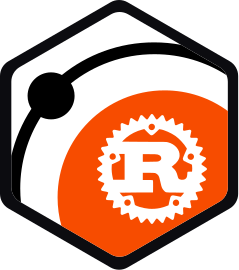
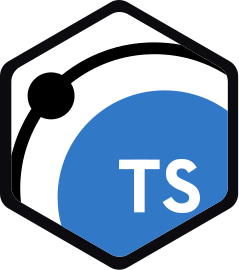
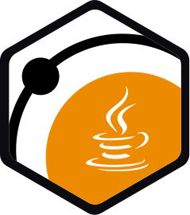

<h1 align="center">
  <a href="https://clusdr.io">
    <picture>
      <source media="(prefers-color-scheme: dark)" srcset="assets/clusdr-lettermark-side-dark.svg">
      
    </picture>
  </a>
</h1>

<p align="center">Distributed coordination runtime and language SDKs. Cluster membership, presence, locks, leases, and events.</p>

<p align="center">
  <a href="https://clusdr.io">clusdr.io</a>
  ·
  <a href="https://clusdr.io/docs/guide/install">Install</a>
  ·
  <a href="https://clusdr.io/docs/">Docs</a>
</p>

<p align="center">
  <a href="https://github.com/clusdr/clusdr">
    <picture>
      <source media="(prefers-color-scheme: dark)" srcset="assets/go-dark.svg">
      
    </picture>
  </a>
  &nbsp;&nbsp;
  <a href="https://github.com/clusdr/clusdr-python">
    <picture>
      <source media="(prefers-color-scheme: dark)" srcset="assets/python-dark.svg">
      
    </picture>
  </a>
  &nbsp;&nbsp;
  <a href="https://github.com/clusdr/clusdr-rust">
    <picture>
      <source media="(prefers-color-scheme: dark)" srcset="assets/rust-dark.svg">
      
    </picture>
  </a>
  &nbsp;&nbsp;
  <a href="https://github.com/clusdr/clusdr-js">
    <picture>
      <source media="(prefers-color-scheme: dark)" srcset="assets/typescript-dark.svg">
      
    </picture>
  </a>
  &nbsp;&nbsp;
  <a href="https://github.com/clusdr/clusdr-java">
    <picture>
      <source media="(prefers-color-scheme: dark)" srcset="assets/java-dark.svg">
      
    </picture>
  </a>
</p>

## Repositories

| Repository | Description |
|---|---|
| [clusdr](https://github.com/clusdr/clusdr) | Distributed coordination runtime in Go. Provides cluster membership, presence, locks, leases, and events through a local daemon and SDK. |
| [clusdr-python](https://github.com/clusdr/clusdr-python) | Python SDK for clusdr, a distributed coordination runtime. Talks to the local daemon for membership, presence, locks, leases, and events. |
| [clusdr-rust](https://github.com/clusdr/clusdr-rust) | Rust SDK for clusdr, a distributed coordination runtime. Talks to the local daemon for membership, presence, locks, leases, and events. |
| [clusdr-js](https://github.com/clusdr/clusdr-js) | TypeScript SDK for clusdr, a distributed coordination runtime. Talks to the local daemon for membership, presence, locks, leases, and events. |
| [clusdr-java](https://github.com/clusdr/clusdr-java) | Java SDK for clusdr, a distributed coordination runtime. Talks to the local daemon for membership, presence, locks, leases, and events. |

## Install

```bash
curl -fsSL https://clusdr.io/install.sh | sh
```

```bash
go get github.com/clusdr/clusdr/sdk
pip install clusdr
cargo add clusdr
npm install clusdr
```

```xml
<dependency>
  <groupId>io.clusdr</groupId>
  <artifactId>clusdr</artifactId>
  <version>0.1.4</version>
</dependency>
```
